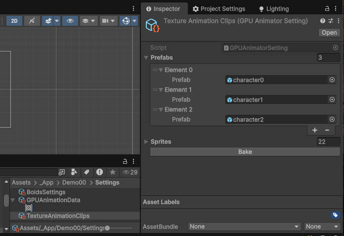
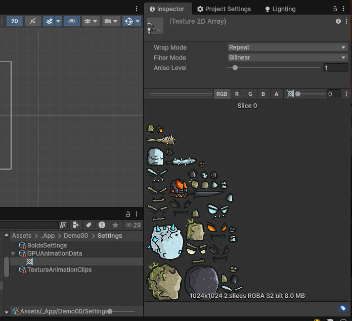

# GPU 2D Animation Engine
Animation Engine that supports sprites and clip 2D animations  
Unity 6.3  
URP  
Demo path: Assets/_App/Demo00/Scenes/SampleScene  

## Workflow:
1. Create a TextureAnimationClip scriptable object instance

2. Assign characters or animated prefabs to the TextureAnimationClip scriptable object instance
3. Press "Bake" button
4. A GPUAnimationData scriptable object instance will be created with all the necessary data to animate all prefabs, including textures.

5. Add the RenderCtrl script to a gameObject of your scene.
6. Assign the GPUAnimationData scriptable object instance to the Animation Data fiels of the RenderCtrl script.

## Demos
GPUAnimationData custom inspector  
  

50 and 3000 instances of animated characters  

